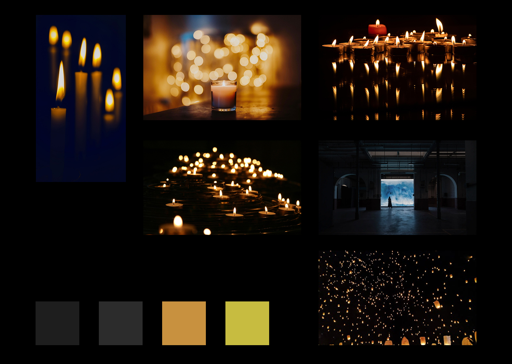
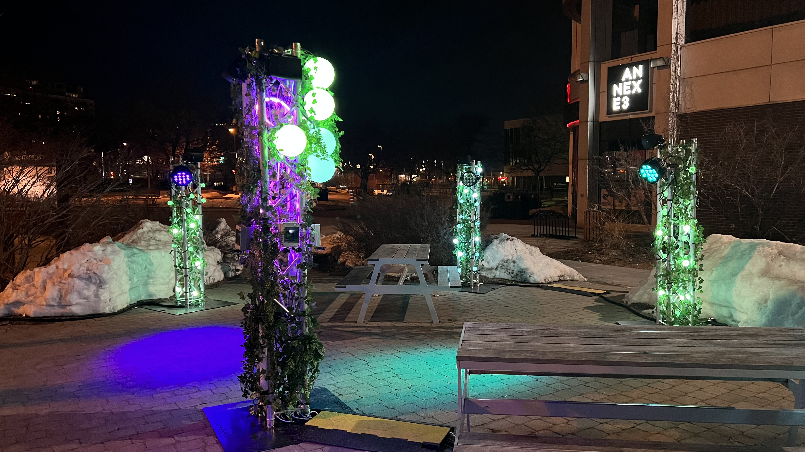

# Concept

## Le pitch initial

<!-- Inclure la vidéo du PowerPoint intial -->

<!-- Méthode 1 -->
<iframe width="560" height="315"
  src="https://www.youtube.com/embed/gskXM5zK3KM"
  title="Voix en soi"
  frameborder="0"
  allowfullscreen>
</iframe>

<!-- Méthode 2, plug legit -->
<!-- 

-->

<!-- Méthode 3 (vidéo local) -->
<!-- 
 
-->

## L'expérience

### Le parcours de l'interacteur

<!-- 
Comportement de l’interacteur
Qu'est-ce que fait l'interacteur?
un résumé du parcours de l'interacteur du début à la fin de son expérience - qu'est-ce qu'il fait, qu'est-ce qu'il manipule, etc
-->

L’interacteur entre dans la pièce. Une bougie s’allume à l’écran, accompagnée d’une note musicale. Lorsque le visiteur s’approche, la flamme à l’écran s’agite davantage et la note change d’intensité.

### L'espace

<!-- 
description de l'espace réel et virtuel du projet et comment l'espace réel est transposé, transorté ou prolongé dans le virtuel et inversement 
-->

L’espace réel est vaste afin d’inviter les interacteurs à se déplacer dans la pièce. Un écran projette des flammes de bougies qui reflètent la présence et la position des interacteurs.

### La progression

<!--  sur le temps et la progression -->
La flamme dépend de la présence de l’interacteur. Lorsqu’une personne quitte la pièce, elle s’éteint et sa note musicale se dissout. En ce qui concerne la progression, les interacteurs ont le pouvoir de modifier l’intensité de la flamme ainsi que celle de la note.

### L'aspect collectif

<!-- 
comment votre idée de projet correspond au thème du COLLECTIF 
Plus il y a de personnes qui peuvent interagir simultanément est un critère important ! 

Un collectif désigne l'ensemble de personnes ou d'entités qui s'unissent de manière concertée pour poursuivre un objectif commun, en coopérant et en collaborant pour atteindre des buts qui seraient difficiles à réaliser individuellement.
 Il peut s'agir d'une réunion informelle ou contractuelle, temporaire ou durable, constituée autour d'une cause, d'une action ou d'un projet, qu'il soit artistique, politique, professionnel, moral ou cultuel.
 Ce groupe, souvent considéré comme une entité à vocation communautaire, fonctionne sous le pilotage de ses membres et repose sur une volonté partagée de développer des solidarités.
-->

Les interacteurs ont le pouvoir de créer ensemble une expérience orchestrale et lumineuse.

### L'aspect social

<!-- 
comment votre idée de projet correspond au thème du SOCIAL 

Le terme « social » désigne ce qui concerne la vie en société, c’est-à-dire les relations entre les individus au sein d’un groupe organisé, ainsi que les structures, normes et institutions qui en découlent.
 Il peut s’appliquer à des aspects variés, comme la vie sociale, les groupes sociaux, les classes sociales, les rapports de production, ou encore les politiques visant à améliorer les conditions de vie des individus.
 En sciences sociales, le social englobe l’étude des phénomènes collectifs, des interactions humaines, des normes sociales et des dynamiques de pouvoir au sein de la société.
 L’adjectif peut aussi qualifier des animaux ou des plantes vivant en communauté selon des règles strictes, comme les insectes sociaux (fourmis, abeilles) ou certaines espèces végétales formant des colonies denses.
-->

La réalisation de cette expérience musicale et lumineuse crée des liens entre les interacteurs.

## Inspirations

### Inspirations visuelles
<!-- Inclure le moodboard avec référenes pour chacune des sources-->

#### Crédits

* [jrydertr](https://pixabay.com/fr/users/jrydertr-13047018/)
* [Ri_Ya](https://pixabay.com/fr/users/ri_ya-12911237/)
* [Pexels](https://pixabay.com/fr/users/pexels-2286921/)
* [StockSnap](https://pixabay.com/fr/users/stocksnap-894430/)
* [Quayola](https://quayola.com/)
<!--
Images inspirantes
Représentations visuelles de l'ambiance recherchée, que ce soit à travers des photographies, des illustrations, ou des œuvres existantes.

Palette de couleurs
Choix de couleurs qui influenceront l’éclairage, les médias projetés, ou l’interface visuelle.

Références multimédia
Vidéos, musiques ou sons, séquences animées qui capturent l’énergie ou la tonalité souhaitée pour l'installation.

Textures et matériaux
Échantillons ou représentations de matériaux tangibles qui seront utilisés dans l'installation (écrans, surfaces tactiles, objets physiques interactifs).

Ambiance sonore et lumineuse
Inspirations relatives à la scénarisation de la lumière et du son, qui seront des éléments interactifs clés dans l’expérience utilisateur.
-->
### Inspirations sonores

#### Références

* [ambiance_1]()
* [ambiance_2]()
* [son_3]()
* [son_4]()

### Inspirations interactives

<!-- Inclure des liens et une ligne sur pourquoi -->

## Scénarimage

<!-- Pour chaque étape/scène : une image avec du texte descriptif et une explication de la transition -->

<!--
Éléments du scénarimage
Séquence visuelle
Chaque scène ou séquence du scénarimage doit être clairement illustrée, montrant les éléments visuels qui seront projetés ou affichés. Cette séquence visuelle peut inclure des captures d'écran, des croquis ou des rendus 3D, en fonction des besoins du projet.

Points d'interaction
Le scénarimage dans un cadre interactif inclut les moments où l'utilisateur interagit avec l'installation. Ces points d’interaction doivent être représentés graphiquement pour indiquer comment et quand l’utilisateur influencera la progression du récit ou des effets visuels et sonores.

Évolution du récit
Comme pour le scénario narratif, le scénarimage doit montrer la progression de l’histoire ou de l’expérience au fil des interactions. Il permet de visualiser comment l’installation évolue en fonction des actions de l'utilisateur, avec des embranchements possibles selon ses choix.

Retour visuel et sensoriel
Le scénarimage doit inclure des annotations ou des visuels montrant les réponses visuelles, sonores ou tactiles à chaque interaction. Cela peut inclure des changements d’éclairage, des transitions vidéo, ou des effets sonores qui réagissent aux actions de l’utilisateur.
-->
