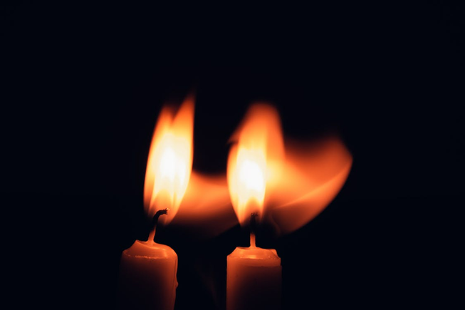
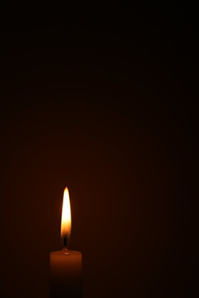
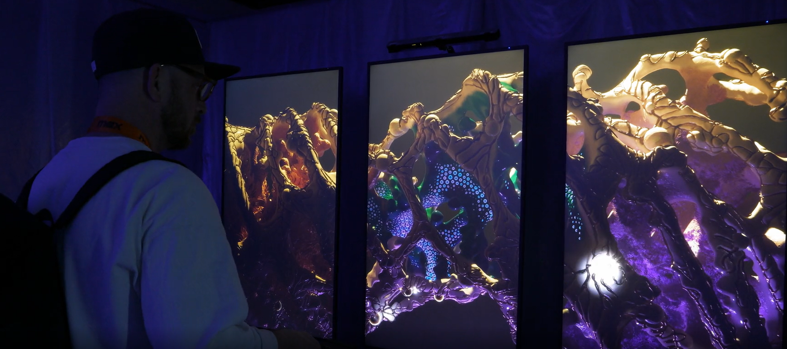
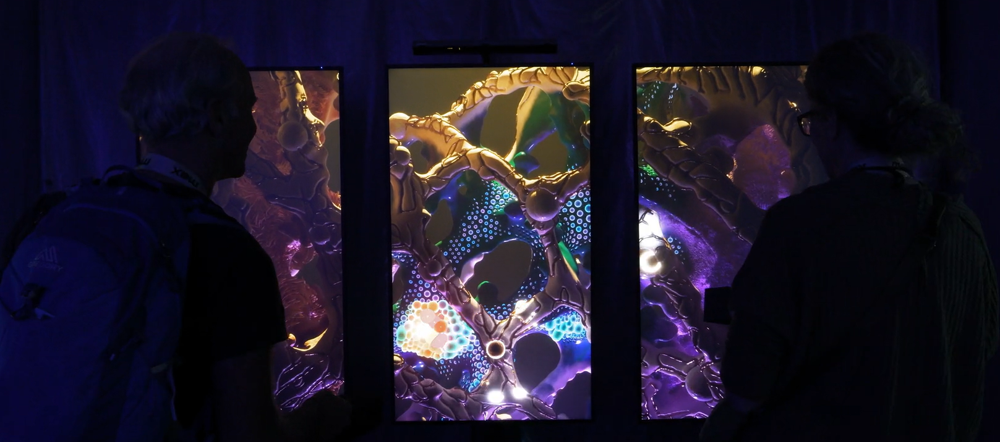
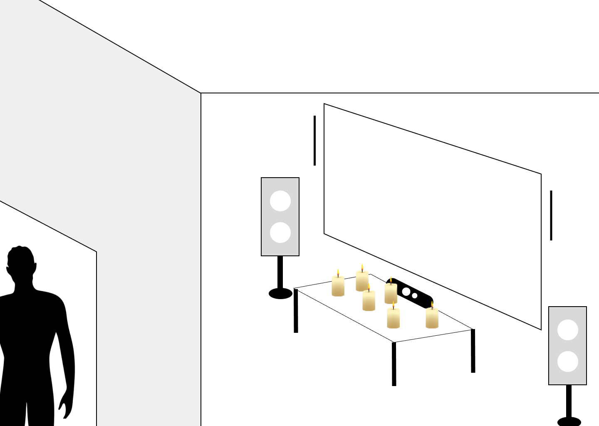
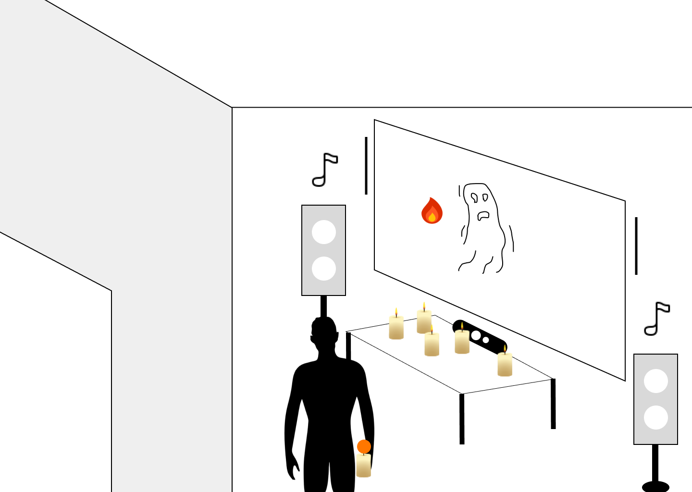
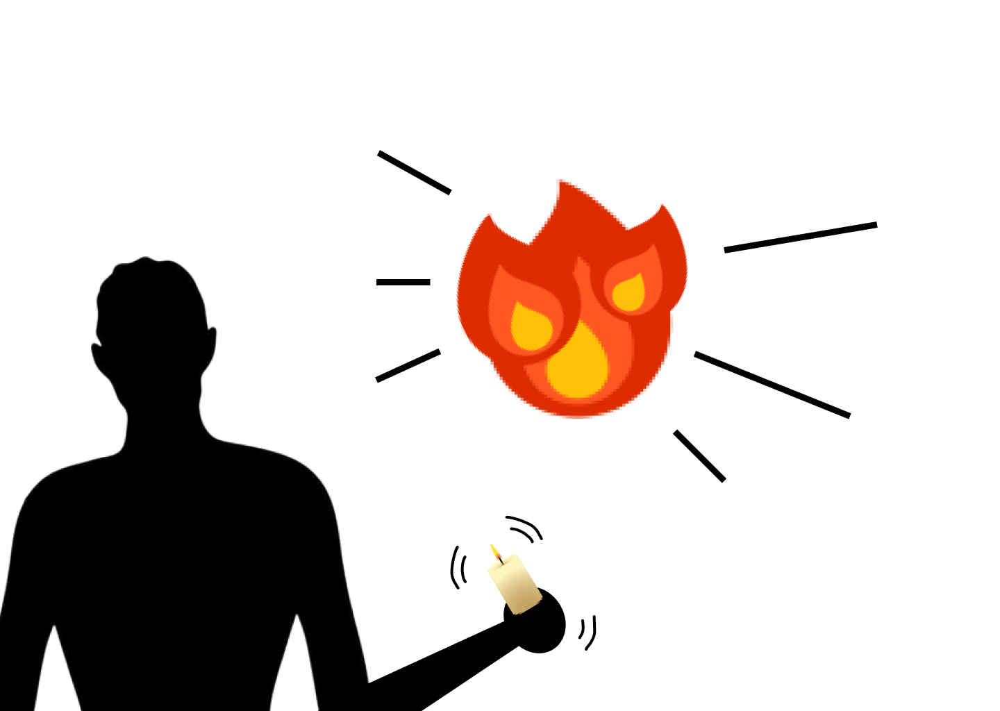
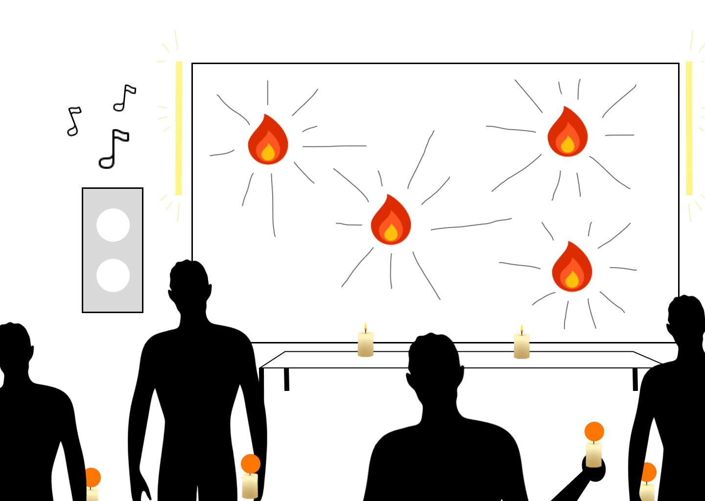

# Concept

## Le pitch initial

<!-- Inclure la vidéo du PowerPoint intial -->

<!-- Méthode 1 -->
<iframe width="560" height="315"
  src="https://www.youtube.com/embed/gskXM5zK3KM"
  title="Voix en soi"
  frameborder="0"
  allowfullscreen>
</iframe>

<!-- Méthode 2, plug legit -->
<!--

-->

<!-- Méthode 3 (vidéo local) -->
<!--
 
-->

## L'expérience

### Le parcours de l'interacteur

<!--
Comportement de l’interacteur
Qu'est-ce que fait l'interacteur?
un résumé du parcours de l'interacteur du début à la fin de son expérience - qu'est-ce qu'il fait, qu'est-ce qu'il manipule, etc
-->

L’interacteur entre dans la pièce. Une flamme de chandelle s’allume sur un mur de la même couleur que la chandelle, accompagnée d’une note musicale synthétique. Des ombres (forme abstrait) évitent la lumière de la flamme. Plus il y a de visiteurs, plus il y a des flammes et de variations sonores. Les visiteurs sont invités à prendre une chandelle (objet physique) posée sur une table. La flamme projetée suit la position de l’objet. Les interacteurs ont le pouvoir, en secouant la chandelle, de modifier l’intensité de la flamme ainsi que celle de la note musicale qui l’accompagne. Dès que l’interacteur quitte la pièce, sa flamme s’éteint et sa note se dissout.

### L'espace

<!--
description de l'espace réel et virtuel du projet et comment l'espace réel est transposé, transorté ou prolongé dans le virtuel et inversement
-->

Notre installation est située dans le grand studio de notre programme Techniques. Le projet partagera l’espace avec d’autres installations voisines. Nous réserverons donc une zone du studio suffisamment grande pour accueillir jusqu’à 5 personnes à la fois, afin qu’elles puissent participer à l’expérience. Donc, environ 3 mètres de longueur 3 mètres de largeurs puis 2.3 mètres de hauteurs.

L’espace réel est encadré de deux LED, afin d’inviter les interacteurs à se déplacer dans les limites de l’installation. Une petite table sera disposée avec de fausses chandelles (objets interactifs) destinées à être utiliser pour l’expérience.

L’espace virtuel (projeté) est sombre avec un image d'une salle (un sous-sol) comme figure de fond, couvert d’ombres représentées par des formes abstraites qui se déplace dans cette salle, qu'on peut manipuler en illuminant la pièce avec les flammes. La position des flammes de chandelles dans la projection correspond aux mêmes coordonnées (x, y) que celles de la chandelle tenue par l’interacteur.

### La progression

<!--  sur le temps et la progression -->

Les interacteurs ont le pouvoir de manipuler le visuel (projeté sur le mur) à l'aide des "chandelles" (objets physiques) pour enrichir leur expérience.

En ce qui concerne la progression, l’interacteur est invité à prendre une chandelle (l’objet) sur la table. La flamme s'allume sur le mur suit la position de l’objet physique. À l’aide de la flamme, la lumière émise par la chandelle repousse les ombres représentant des forces négatives (les oppresseurs) sur son chemin. Les visiteurs peuvent agiter la chandelle pour modifier l’apparence de leur flamme ainsi que sa note musicale. Ces modifications influencent à la fois l’intensité de la lumière et la hauteur (le pitch) des sons émis par ces flammes. En agitant l'objet, l'interacteur perçoit que les ombres se déplace pour éviter la flamme de la chandelle.

Un maximum de 5 visiteurs peuvent participer simultanément à l’expérience : 5 flammes apparaissent alors sur le mur. Ensemble, ces flammes unissent leurs forces pour chasser les ombres hors du mur. Quand les ombres ont complètement disparu, une animation lumineuse aux teintes chaudes se déclenche, accompagnée d’une musique. Après que les interacteurs déposent les chandelles, un fondu (« fade out ») des lumières de la pièce s’amorce, permettant de revenir à l’état initial dans (l’obscurité) afin que les ombres reprennent le contrôle du mur.

### L'aspect collectif

<!--
comment votre idée de projet correspond au thème du COLLECTIF
Plus il y a de personnes qui peuvent interagir simultanément est un critère important !

Un collectif désigne l'ensemble de personnes ou d'entités qui s'unissent de manière concertée pour poursuivre un objectif commun, en coopérant et en collaborant pour atteindre des buts qui seraient difficiles à réaliser individuellement.
 Il peut s'agir d'une réunion informelle ou contractuelle, temporaire ou durable, constituée autour d'une cause, d'une action ou d'un projet, qu'il soit artistique, politique, professionnel, moral ou cultuel.
 Ce groupe, souvent considéré comme une entité à vocation communautaire, fonctionne sous le pilotage de ses membres et repose sur une volonté partagée de développer des solidarités.
-->

Les ombres sont des dangers qui persistent dans l’obscurité tout au long de l’expérience. Elles hantent et intimident lorsqu’une personne tente de les éloigner. Ainsi, les participants sont encouragés à se rassembler et à utiliser les chandelles (objets) pour chasser ensemble ces forces perturbatrices.

Bref, la présence des ombres encourage les interacteurs a se réuinir pour les chasser à l'aide des chandelles physiques.

### L'aspect social

<!--
comment votre idée de projet correspond au thème du SOCIAL

Le terme « social » désigne ce qui concerne la vie en société, c’est-à-dire les relations entre les individus au sein d’un groupe organisé, ainsi que les structures, normes et institutions qui en découlent.
 Il peut s’appliquer à des aspects variés, comme la vie sociale, les groupes sociaux, les classes sociales, les rapports de production, ou encore les politiques visant à améliorer les conditions de vie des individus.
 En sciences sociales, le social englobe l’étude des phénomènes collectifs, des interactions humaines, des normes sociales et des dynamiques de pouvoir au sein de la société.
 L’adjectif peut aussi qualifier des animaux ou des plantes vivant en communauté selon des règles strictes, comme les insectes sociaux (fourmis, abeilles) ou certaines espèces végétales formant des colonies denses.
-->

La peur du noir, ou nyctophobie, est assez fréquente dans de nombreuses sociétés, même si elle n’est pas universelle. Dans notre culture, l’obscurité était souvent associée au danger, aux monstres et aux mauvais esprits, ce qui renforçait la crainte du noir. Aujourd’hui, cette peur persiste chez certaines personnes, car l’absence de lumière crée un sentiment d’insécurité et d’incertain.

Nous avons choisi ce sujet parce que nous avons remarqué autour de nous que certaines personnes ont peur du noir tandis que d’autres non. En affrontant cette peur ensemble, nous créons des liens à travers l’expérience partagée : nous communiquons, coopérons et nous soutenons mutuellement. Cela montre que notre vrai pouvoir réside dans le rassemblement, et que la peur peut se transformer en une occasion de renforcer nos liens.

## Inspirations

### Inspirations visuelles

<!-- Inclure le moodboard avec référenes pour chacune des sources-->

 

#### L'ambiance de la salle et l'espace virtuel

<!--
Images inspirantes
Représentations visuelles de l'ambiance recherchée, que ce soit à travers des photographies, des illustrations, ou des œuvres existantes.

Palette de couleurs
Choix de couleurs qui influenceront l’éclairage, les médias projetés, ou l’interface visuelle.

Références multimédia
Vidéos, musiques ou sons, séquences animées qui capturent l’énergie ou la tonalité souhaitée pour l'installation.

Textures et matériaux
Échantillons ou représentations de matériaux tangibles qui seront utilisés dans l'installation (écrans, surfaces tactiles, objets physiques interactifs).

Ambiance sonore et lumineuse
Inspirations relatives à la scénarisation de la lumière et du son, qui seront des éléments interactifs clés dans l’expérience utilisateur.
-->

### Inspirations sonores

#### Références

[Calm Horizons Par Universfield](calm-horizons-351492.mp3)
[Ambient Background Soundscape Music Par Universfield](ambient-background-351471.mp3)
[Calm Ambient soundscape for focus Par Lilliben](calm-ambient-soundscape-for-focus-365156.mp3)

### Inspirations interactives

<!-- Inclure des liens et une ligne sur pourquoi -->

L'utilisation d'objets physiques pour manipuler le monde virtuel. (Enrichir l'expérience)

## Scénarimage

<!-- Pour chaque étape/scène : une image avec du texte descriptif et une explication de la transition -->

<!--
Éléments du scénarimage
Séquence visuelle
Chaque scène ou séquence du scénarimage doit être clairement illustrée, montrant les éléments visuels qui seront projetés ou affichés. Cette séquence visuelle peut inclure des captures d'écran, des croquis ou des rendus 3D, en fonction des besoins du projet.

Points d'interaction
Le scénarimage dans un cadre interactif inclut les moments où l'utilisateur interagit avec l'installation. Ces points d’interaction doivent être représentés graphiquement pour indiquer comment et quand l’utilisateur influencera la progression du récit ou des effets visuels et sonores.

Évolution du récit
Comme pour le scénario narratif, le scénarimage doit montrer la progression de l’histoire ou de l’expérience au fil des interactions. Il permet de visualiser comment l’installation évolue en fonction des actions de l'utilisateur, avec des embranchements possibles selon ses choix.

Retour visuel et sensoriel
Le scénarimage doit inclure des annotations ou des visuels montrant les réponses visuelles, sonores ou tactiles à chaque interaction. Cela peut inclure des changements d’éclairage, des transitions vidéo, ou des effets sonores qui réagissent aux actions de l’utilisateur.
-->

À son état neutre, la zone de notre projet est plongée dans le noir.

Lorsqu’un visiteur entre dans la zone, une flamme symbolisant sa présence s’illumine sur le mur, et l’une des chandelles s’allume. Au même moment, une ambiance sonore sort des haut-parleurs. La lumière de la flamme révèle alors les esprits qui habitent la projection.

Lorsque l’interacteur agite vivement sa bougie, la flamme de la projection change, grossit et se modifie.

Quand un autre interacteur arrive dans la zone et prend une bougie, le même processus se répète pour lui.

Quand plusieurs interacteurs sont dans la zone (quatre personnes ou plus), les flammes des interacteurs éclairent tout l'espace virtuel et font disparaître les esprits. De plus, la musique change et les LED sur les côtés de la projection s’allument.
