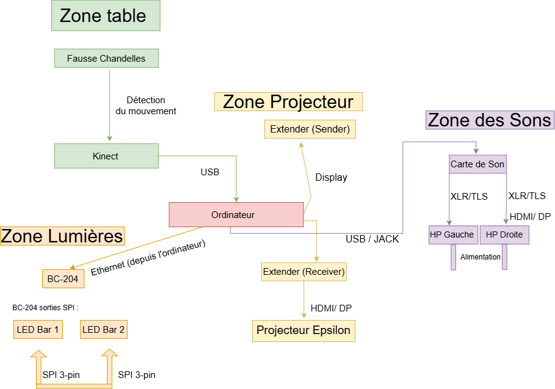
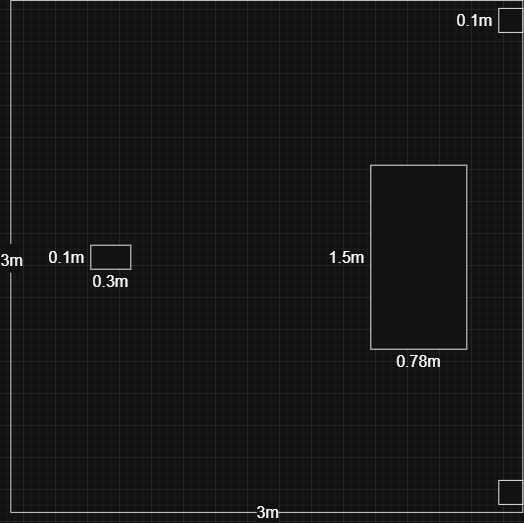
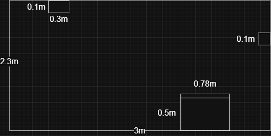
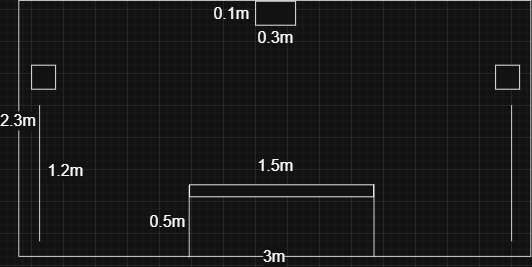

# Maquette (faisabilité)


https://tim-montmorency.com/582523-gestion/#/contenus/3_planification/

## Scénarisation

#### Scène 1 :

| Action | Condition de déclenchement | Effet visuel | Effet sonore | Effet interactif |
| :------------------- | :----------: | :----------: | :----------: |----------: |
| Entrer | Le visiteur rentre dans la zone de détection | Une chandelle sur la table s’illumine | Une note de piano est entendu à l’allumage de la chandelle | Activation du systeme de detection de mouvement |
| Prendre chandelle  | L’interacteur dépladé la chandelle devant le projecteur dans l'axe(y) | Une flamme de la même couleur de border que la chandelle apparait a la meme position (x,y) que la chandelle | Lorsque la flamme apparait un bruit d'etincelle est declenché | L'installation reconnait l'existance de la flamme et passe à la scène 2 |

#### Scène 2 :

| Action | Condition de déclenchement | Effet visuel | Effet sonore | Effet interactif |
| :------------------- | :----------: | :----------: | :----------: |----------: |
| Bouger de chandelle  | L’interacteur déplace la chandelle qui illumine devant le projecteur | La flamme suit la chandelle à la même position (x, y) | Lorsque la chandelle est déplacé, un bruit de vent mélodieux se fait entendre | L'installation s'incroniser la position (x,y) de la flamme a celle de la chandelle |
| Agiter chandelle  | La chandelle faible a etais secouer 10 fois | La flamme s’agrandit, devient forte et éclaire dans un certain rayon, ce qui peut faire apparaître une ombre se cachant dans le fond noir, avant que l’ombre ne se dissous | Un sons de feu qui s'intensifit est activer | Activation de l'animation sur l'ombre et de la position |
| Entrer | Cinq forte flamme sont detecter | Tout l’environnement dans le projecteur est illuminé, les deux LEDs brillent couleur feu | Musique composer de toute les notes qui etais activer au debut  |  Fin de cycle – passe à la scène 3 |

#### Scène 3 :

| Action | Condition de déclenchement | Effet visuel | Effet sonore | Effet interactif |
| :------------------- | :----------: | :----------: | :----------: |----------: |
| Quitter | Durée des effets lumineux et sons finaux pendant 1 minute | Toute les sources de lumieurs s'eteigne pendant 30 seconde | Plus de musique ni de sons 30 seconde | Passe à la scène 1 |


<!--## Étapes clés de la maquette

### 1. Ascpect technique
- **Analyse des exigences techniques** : Définir les spécifications techniques du projet, y compris les logiciels, le matériel, les interfaces utilisateur et les protocoles de communication.  
- **Compatibilité du système** : Vérifier si les nouvelles technologies interactives sont compatibles avec les systèmes existants.  
- **Tests** : Effectuer des tests pour valider les fonctionnalités et l'interactivité.  

### 2. Ascpect économique
- **Estimation des coûts** : Calculer les coûts associés à l'acquisition de matériel, de logiciels, au développement et à la maintenance.  
- **Analyse du retour sur investissement (ROI)** : Évaluer les bénéfices potentiels par rapport aux coûts engagés.  
- **Options de financement** : Explorer les subventions, les partenariats ou les modèles économiques alternatifs.  

### 3. LES RÈGLES ET LE SYSTÈME 

```mermaid
graph LR
    Règles --> 

## Liste d'équipements


### Équipements générals
| Nom d'équipement| Quantité | Fonction | Offert par le Programme | 
| :------------------- | :----------: | :----------: |----------: |
| Ordinateur | 1 | Poste source / Traitement du fonction de l'installation | oui |
| Câble Ethernet| 1 | Connecter l'ordinateur à l'ethernet | oui |
| Câble rallonge | 4 | Aide à l'allimentation des objets techniques | oui |
| Fausse chandelle | 5 | Objets interactif qui manipulent l'installation | non |
| Table | 1 | Support les chandelles interactives | non |
| Nappe pour table | 1 | Décoration pour que la table soit cohérent avec l'ambiance | non |

### Équipements visuels
| Nom d'équipement| Quantité | Fonction | Offert par le Programme | 
| :------------------- | :----------: | :----------: |----------: |
| Projecteur Epsilon | 1 | Projeter le visuel sur le mur | oui |
| Câble d'alimentation| 1 | Alimenter le projecteur | oui |
| Extendeur (receiver/sender) | 1 | Étendre la connection du projecteur et l'ordinateur | oui |
| Câble Ethernet| 3 | Connecter le projecteur et les extendeurs | oui |
| Barre lumière DEL (LED Pixel Bar)| 2 | Projeter de la lumière d'ambiance | oui |
| BC-204 (contrôleur arnet vers SPI/DMX) | 1 | Connecter les lumières DEL à l'ordinateur | oui |
| Câble connecteur SPI extension (3 pin) | 3 | Connecter les lumières DEL entre eux et le controleur arnet | oui |
| Câble Display Port | 2 | Connecter le contrôleur vers l'ordinateur  et l'ordinateur vers le extendeur| oui |
| Kinect | 1 | Capturer le mouvement de l'interacteur avec la chandelle et envoyer les donnés à l'ordinateur | oui |


### Équipements sonores
| Nom d'équipement| Quantité | Fonction | Offert par le Programme | 
| :------------------- | :----------: | :----------: |----------: |
| Haut-parleur| 2 | Projeter les effets sonores | oui |
| Câble XLR| 2 | Connecter les hauts-parleur au carte de son | oui |
| Câble TLS| 2 | Connecter les hauts-parleur au carte de son | oui |
| Carte de son| 1 | Manipule les effets sonores par l'ordinateur | oui |
| Câble d'alimentation| 2 | Alimenter les hauts-parleur | oui |


## Liste de logiciels

| Nom de logiciel | Fonction | Prix |  Offert par le Programme | 
| :------------------- | :----------: | :----------:  |----------: |
| OBS | Projection du visuel et Activation des barres DEL | 0,00$ |  oui |
| TouchDesigner | Traitement du visuel et sonore en temps réel | 0,00$ (version gratuite) |  oui |
| Maya | Création environnement, ombres et flammes | 350$/mois |  oui |
| Reaper | Création des effets sonores | 0,00$ |  oui |
| Surge XT | Création de l'ambiance sonore | 0,00$ | oui |
| HyperHRD| Manipulation des lumières DEL| 0,00$ |  oui |
| Visuel Studio Code | Programmation de l'intéraction| 0,00$ |  oui |
| Pure Data | Communication du programmation de l'interaction des chandelles vers le visuel virtuel | 0,00$ |  oui |
| Unity | Déplacement des flammes et les ombres dans l'espace virtuel | 0,00$ (version gratuite) | oui |

## Synoptique



## Plan d'implantation

### 2D






### 3D

## Budget

| Nom | Quantité | Prix 
| :------------------- | :----------: |----------: |
| Projecteur Epsilon| 1 | ---|
| Fausse chandelle | 5 | ---|
| Table | 1 | ---|
| Nappe de Table | 1 | ---|
| Kinect | 1 | ---|
| Haut-Parleur | 2 | ---|
| BC-204 (contrôleur arnet vers SPI/DMX) | 1 | ---|
| Barre lumière DEL | 2 | ---|
| Extendeur | 1 | ---|
| Carte de son | 1 | ---|
| Câble Ethernet| x | ---|
| Câble d'alimentation| x | ---|
| Câble XLR| x | ---|
| Câble TLS| x | ---|
| Câble Display Port| x | ---|
| Câble connecteur SPI| x | ---|
| Câble rallonge (multi prises)| x | ---|

### Sous Total