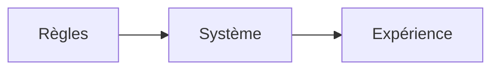

# Maquette (faisabilité)

<!--
https://tim-montmorency.com/582523-gestion/#/contenus/3_planification/

# Maquette

## Importance de la maquette dans les projets multimédias
Une maquette permet de déterminer si un projet est réalisable sur les plans technique, économique et opérationnel. Elle aide à identifier les obstacles potentiels et à planifier les ressources nécessaires. Dans le contexte des technologies interactives, où les innovations sont rapides et les attentes des utilisateur·rice·s élevées, cette démarche devient encore plus critique.

## Étapes clés de la maquette

### 1. Ascpect technique
- **Analyse des exigences techniques** : Définir les spécifications techniques du projet, y compris les logiciels, le matériel, les interfaces utilisateur et les protocoles de communication.  
- **Compatibilité du système** : Vérifier si les nouvelles technologies interactives sont compatibles avec les systèmes existants.  
- **Tests** : Effectuer des tests pour valider les fonctionnalités et l'interactivité.  

### 2. Ascpect économique
- **Estimation des coûts** : Calculer les coûts associés à l'acquisition de matériel, de logiciels, au développement et à la maintenance.  
- **Analyse du retour sur investissement (ROI)** : Évaluer les bénéfices potentiels par rapport aux coûts engagés.  
- **Options de financement** : Explorer les subventions, les partenariats ou les modèles économiques alternatifs.  

### 3. LES RÈGLES ET LE SYSTÈME 

1. **Les règles sont les briques de base.**  
2. **Le système applique les règles.**  
3. **L’expérience est la perspective du joueur.**  

### 4. Asect temporelle
- **Planification du projet** : Établir un calendrier réaliste en tenant compte des délais de développement, de test et de déploiement.  
- **Gestion des risques** : Identifier les risques potentiels qui pourraient retarder le projet et prévoir des plans d'urgence.  

### 5. Aspect légal et éthique
- **Conformité réglementaire** : S'assurer que le projet respecte les lois en vigueur, notamment en matière de propriété intellectuelle et de protection des données.  
- **Accessibilité** : Garantir que l'installation interactive est accessible à tous les utilisateur·rice·s, y compris les personnes en situation de handicap.  

-->