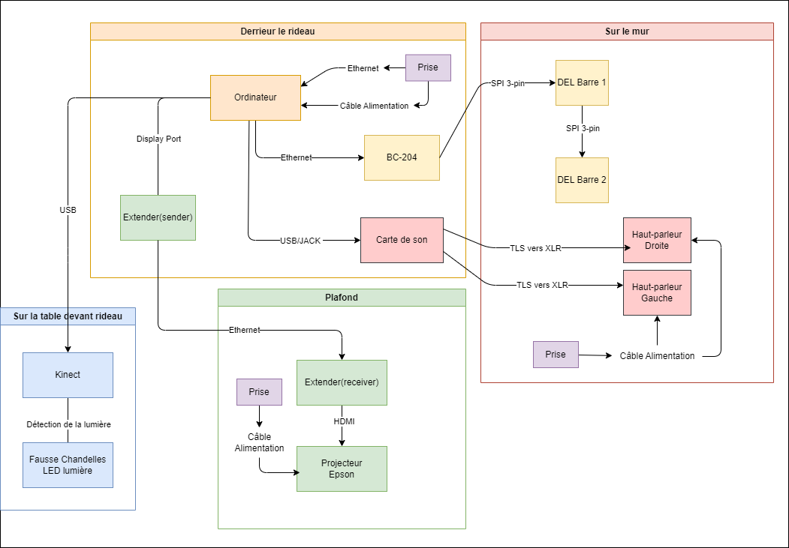
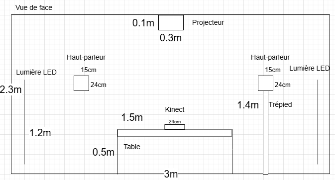
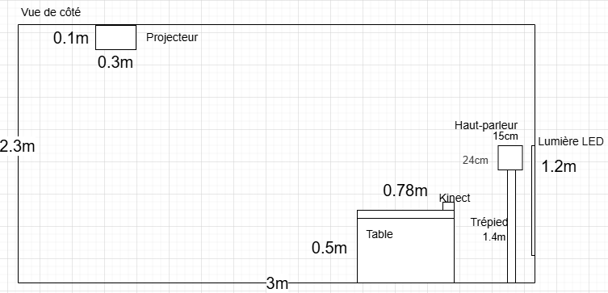
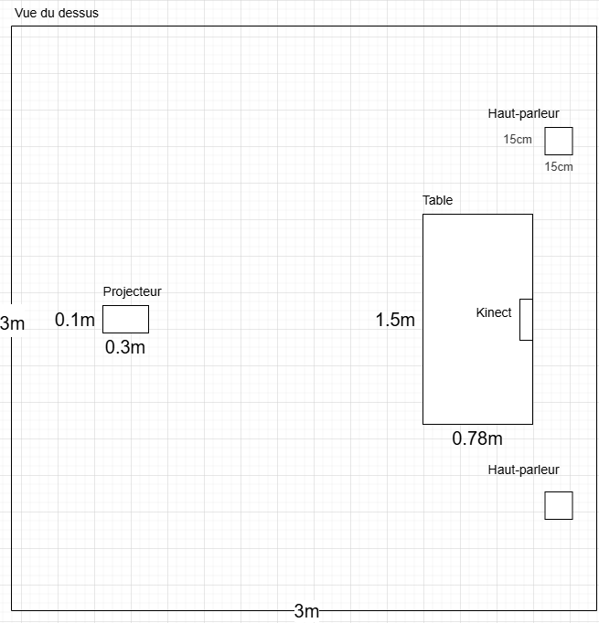
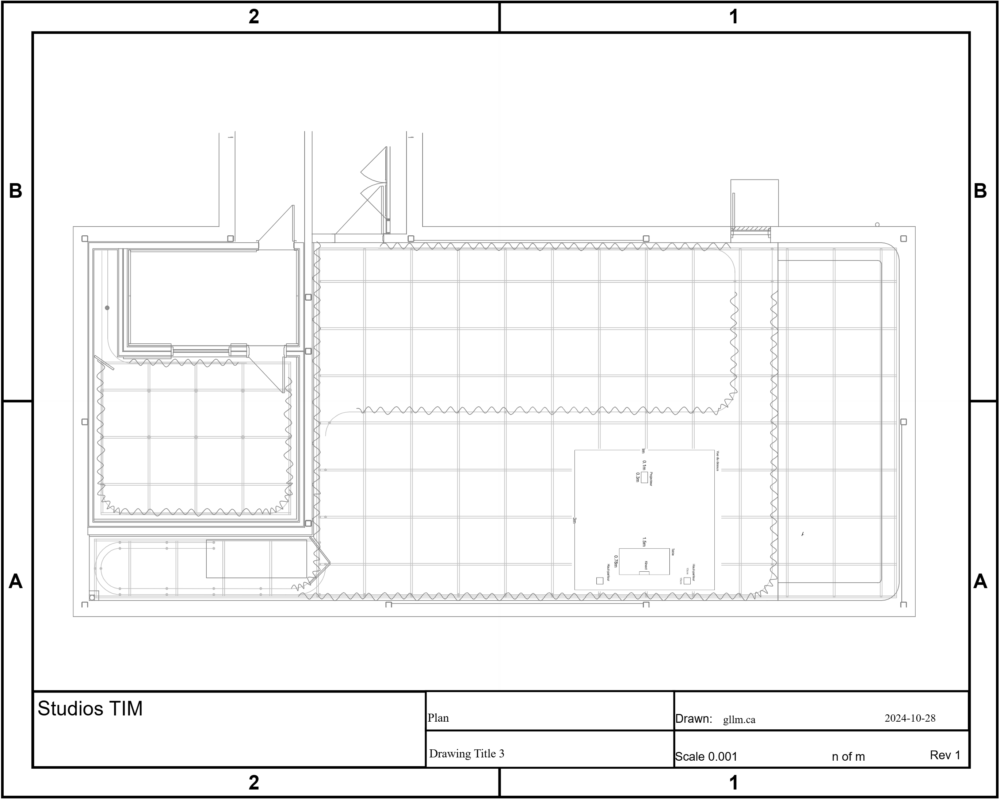
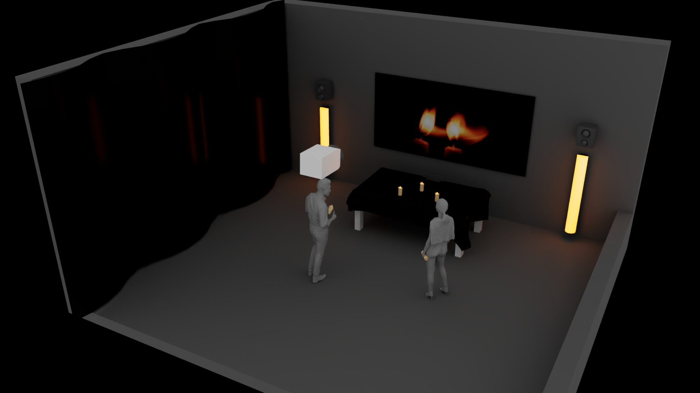
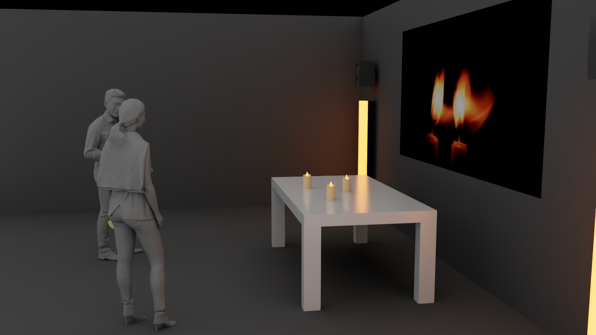
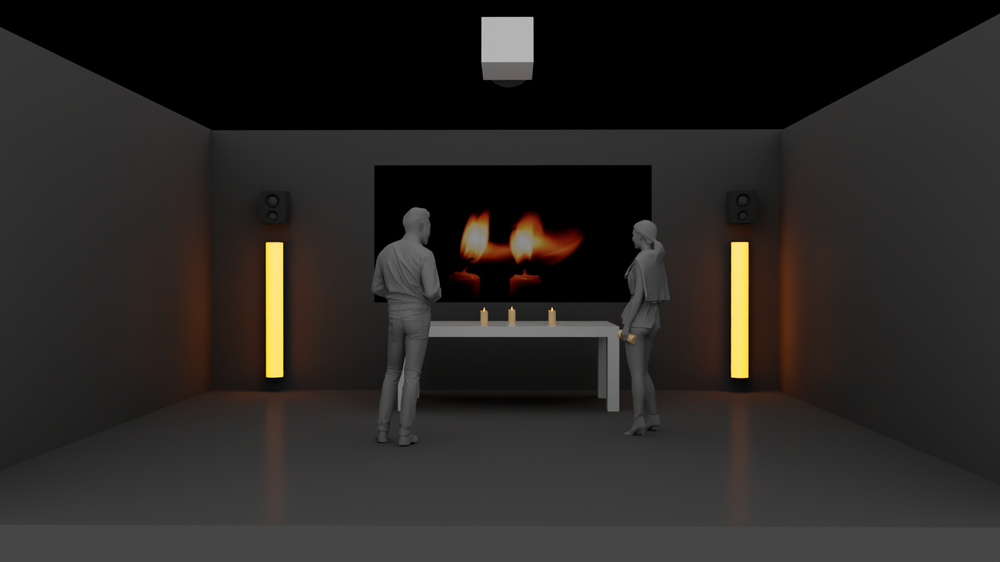
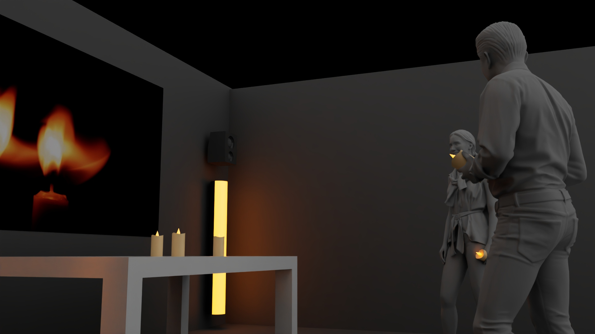

# Maquette (faisabilité)

https://tim-montmorency.com/582523-gestion/#/contenus/3_planification/

## Scénarisation

#### Scène 1 :

| Action            |                        Condition de déclenchement                         |                                                                 Effet visuel                                                                 |                          Effet sonore                           |                                                         Effet interactif |
| :---------------- | :-----------------------------------------------------------------------: | :------------------------------------------------------------------------------------------------------------------------------------------: | :-------------------------------------------------------------: | -----------------------------------------------------------------------: |
| Entrer            |               Le visiteur entre dans la zone de détection.                | Une chandelle sur la table s’illumine, et une flamme de la même couleur que son contour apparaît à la même position (x, y) que la chandelle. |  Une note de piano est entendue à l’allumage de la chandelle.   |                         Activation du système de détection de mouvement. |
| Prendre chandelle | L’interacteur déplace la chandelle devant le projecteur sur l’axe (x, y). |                       La flamme se déplace aux mêmes coordonnées (x, y) que la chandelle et elle s’illumine davantage.                       | Lorsque la flamme apparaît, un bruit d’étincelle est déclenché. | L’installation reconnaît l’existence de la flamme et passe à la scène 2. |

#### Scène 2 :

| Action              |                        Condition de déclenchement                        |                                                                                   Effet visuel                                                                                   |                                  Effet sonore                                   |                                                                       Effet interactif |
| :------------------ | :----------------------------------------------------------------------: | :------------------------------------------------------------------------------------------------------------------------------------------------------------------------------: | :-----------------------------------------------------------------------------: | -------------------------------------------------------------------------------------: |
| Bouger de chandelle | L’interacteur déplace la chandelle, qui s’illumine devant le projecteur. |                                                              La flamme suit la chandelle à la même position (x, y).                                                              | Lorsque la chandelle est déplacée, un bruit de vent mélodieux se fait entendre. | L’installation synchronise la position (x, y) de la flamme avec celle de la chandelle. |
| Agiter chandelle    |                La chandelle faible a été secouée 10 fois.                | La flamme s’agrandit, devient intense et éclaire dans un certain rayon, ce qui peut faire apparaître une ombre se dessinant sur le fond noir, avant que celle-ci ne se dissolve. |                   Un son de feu qui s’intensifie est activé.                    |                                Activation de l’animation de l’ombre et de sa position. |
| Detecter flammes    |                   Cinq fortes flammes sont détectées.                    |                                          Tout l’environnement dans le projecteur est illuminé, et les deux LED brillent de couleur feu.                                          |     Musique composée de toutes les notes qui avaient été activées au début.     |                                                      Fin de cycle – passe à la scène 3 |

#### Scène 3 :

| Action  |                    Condition de déclenchement                    |                          Effet visuel                          |                  Effet sonore                   |   Effet interactif |
| :------ | :--------------------------------------------------------------: | :------------------------------------------------------------: | :---------------------------------------------: | -----------------: |
| Quitter | La durée des effets lumineux et sonores finaux est d’une minute. | Toutes les sources de lumière s’éteignent pendant 30 secondes. | Plus de musique ni de sons pendant 30 secondes. | Passe à la scène 1 |

<!--## Étapes clés de la maquette

### 1. Ascpect technique
- **Analyse des exigences techniques** : Définir les spécifications techniques du projet, y compris les logiciels, le matériel, les interfaces utilisateur et les protocoles de communication.
- **Compatibilité du système** : Vérifier si les nouvelles technologies interactives sont compatibles avec les systèmes existants.
- **Tests** : Effectuer des tests pour valider les fonctionnalités et l'interactivité.

### 2. Ascpect économique
- **Estimation des coûts** : Calculer les coûts associés à l'acquisition de matériel, de logiciels, au développement et à la maintenance.
- **Analyse du retour sur investissement (ROI)** : Évaluer les bénéfices potentiels par rapport aux coûts engagés.
- **Options de financement** : Explorer les subventions, les partenariats ou les modèles économiques alternatifs.

### 3. LES RÈGLES ET LE SYSTÈME

```mermaid
graph LR
    Règles -->

## Liste d'équipements

### Équipements générals

| Nom d'équipement                  | Quantité |                          Fonction                          | Offert par le Programme |
| :-------------------------------- | :------: | :--------------------------------------------------------: | ----------------------: |
| Ordinateur                        |    1     |  Poste source / Traitement du fonction de l'installation   |                     oui |
| Câble Ethernet                    |    1     |            Connecter l'ordinateur à l'ethernet             |                     oui |
| Câble d'alimentation              |    1     |                   Alimenter l'ordinateur                   |                     oui |
| Câble rallonge (prises multiples) |    4     |        Aide à l'allimentation des objets techniques        |                     oui |
| Fausse chandelle                  |    5     |      Objets interactif qui manipulent l'installation       |                     non |
| Table                             |    1     |            Support les chandelles interactives             |                     non |
| Nappe noire pour table            |    1     | Décoration pour que la table soit cohérent avec l'ambiance |                     non |

### Équipements visuels

| Nom d'équipement                       | Quantité |                                           Fonction                                            | Offert par le Programme |
| :------------------------------------- | :------: | :-------------------------------------------------------------------------------------------: | ----------------------: |
| Projecteur Epson                       |    1     |                                 Projeter le visuel sur le mur                                 |                     oui |
| Câble d'alimentation                   |    1     |                                    Alimenter le projecteur                                    |                     oui |
| Extendeurs HDMI Cat6                   |    1     |                      Étendre la connection du projecteur et l'ordinateur                      |                     oui |
| Câble Ethernet                         |    3     |                           Connecter le projecteur et les extendeurs                           |                     oui |
| Barre lumière DEL (LED Pixel Bar)      |    2     |                               Projeter de la lumière d'ambiance                               |                     oui |
| BC-204 (contrôleur arnet vers SPI/DMX) |    1     |                           Connecter les lumières DEL à l'ordinateur                           |                     oui |
| Câble connecteur SPI extension (3 pin) |    3     |                  Connecter les lumières DEL entre eux et le controleur arnet                  |                     oui |
| Câble Display Port                     |    2     |          Connecter le contrôleur vers l'ordinateur et l'ordinateur vers le extendeur          |                     oui |
| Kinect                                 |    1     | Capturer le mouvement de l'interacteur avec la chandelle et envoyer les donnés à l'ordinateur |                     oui |

### Équipements sonores

| Nom d'équipement     | Quantité |                   Fonction                   | Offert par le Programme |
| :------------------- | :------: | :------------------------------------------: | ----------------------: |
| Haut-parleur Genelec |    2     |         Projeter les effets sonores          |                     oui |
| Trépied Manfrotto    |    2     |          Soutenir les haut-parleurs          |                     oui |
| Câble XLR            |    2     | Connecter les haut-parleurs au carte de son  |                     oui |
| Câble TLS            |    2     | Connecter les haut-parleurs au carte de son  |                     oui |
| Carte de son         |    1     | Manipule les effets sonores par l'ordinateur |                     oui |
| Câble d'alimentation |    2     |         Alimenter les haut-parleurs          |                     oui |

## Liste de logiciels

| Nom de logiciel    |                                       Fonction                                        |           Prix           | Offert par le Programme |
| :----------------- | :-----------------------------------------------------------------------------------: | :----------------------: | ----------------------: |
| OBS                |                   Projection du visuel et Activation des barres DEL                   |          0,00$           |                     oui |
| TouchDesigner      |                     Traitement du visuel et sonore en temps réel                      | 0,00$ (version gratuite) |                     oui |
| Maya               |                       Création environnement, ombres et flammes                       |        350$/mois         |                     oui |
| Reaper             |                              Création des effets sonores                              |          0,00$           |                     oui |
| Surge XT           |                             Création de l'ambiance sonore                             |          0,00$           |                     oui |
| HyperHRD           |                             Manipulation des lumières DEL                             |          0,00$           |                     oui |
| Visuel Studio Code |                            Programmation de l'intéraction                             |          0,00$           |                     oui |
| Pure Data          | Communication du programmation de l'interaction des chandelles vers le visuel virtuel |          0,00$           |                     oui |
| Unity              |              Déplacement des flammes et les ombres dans l'espace virtuel              | 0,00$ (version gratuite) |                     oui |

## Synoptique



## Plan d'implantation

### 2D






### 3D






## Budget

| Nom                                    | Quantité | Prix unitaire |     Coût total |
| :------------------------------------- | :------: | :-----------: | -------------: |
| Fausse chandelle                       |    5     |    20,00 $    |        60,00 $ |
| Nappe de Table noire                   |    1     |    17,00 $    |        17,00 $ |
| Kinect                                 |    1     |    31,00 $    |        31,00 $ |
| Résultat Total                         |          |               |        108 $ |

### Résultat Total : 108 $
